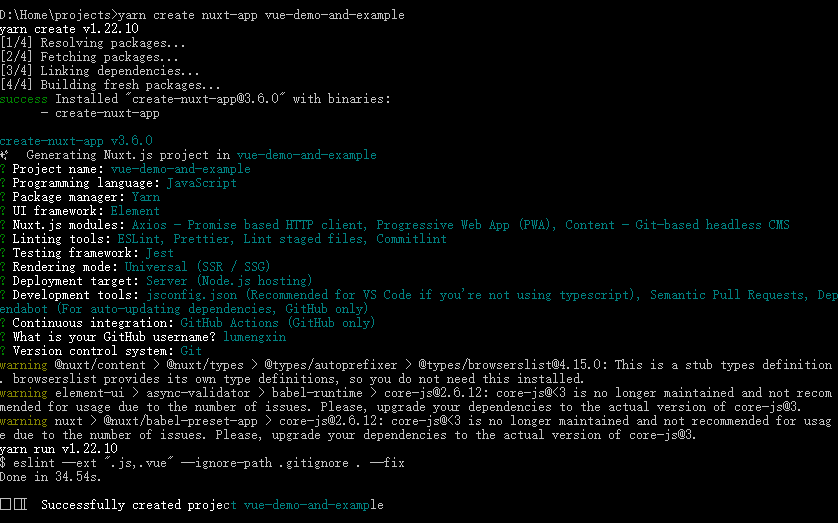

# vue-demo-and-example

## 开始

```bash
# 安装依赖
$ yarn install

# 在本地主机上热加载服务 localhost:3000
$ yarn dev

# 为生产和启动服务器构建
$ yarn build
$ yarn start

# 生成静态项目
$ yarn generate
```

## 初始项目

构建工具初始化一个项目

`yarn create nuxt-app vue-demo-and-example`



## 项目规范

### commit规范

[git commit](https://juejin.cn/post/6863047306754097160)配置

## 开发

